<!--
  ╔══════════════════════════════════════════════════════════════════╗
  ║  CHAMARA KARUNARATHNA · animated profile README                  ║
  ║  All visuals are self-contained animated SVGs in ./assets        ║
  ║  → Replace the LinkedIn "#" link below with your profile URL      ║
  ╚══════════════════════════════════════════════════════════════════╝
-->

  

 

<!-- ─────────────────────────────── 01 · WHOAMI ─────────────────────────────── -->

  

  

 

<!-- ─────────────────────────── 02 · LET'S WORK TOGETHER ─────────────────────────── -->

  

  
  
  

 

<!-- ─────────────────────────── 03 · WORK EXPERIENCE ─────────────────────────── -->

  

  

  

  

  

 

<!-- ─────────────────────────── 04 · TECHNICAL SKILLS ─────────────────────────── -->

  

  

 

<!-- ─────────────────────────────── 05 · EDUCATION ─────────────────────────────── -->

  

  

 

  

